# Primeira Parte - Holdout e métricas básicas de desempenho


### O holdout mais simples do mundo

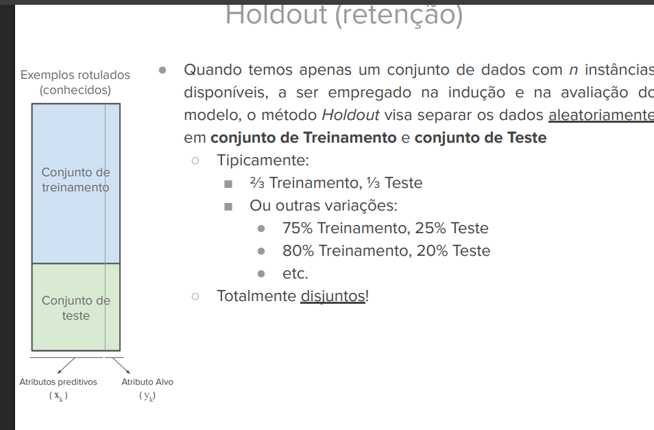

Divide 80% pra treino e 20% pra teste

```python3
X_train, X_test, y_train, y_test = train_test_split(
    X,
    y,
    test_size=0.2,
    random_state=42,
    stratify=y
)
model = DecisionTreeClassifier(max_depth=5, random_state=42)
model.fit(X_train, y_train)
y_pred = model.predict(X_test)
acc_score = accuracy_score(y_test, y_pred)
print(f'A acurácia é: {acc_score}')

```

#### Holdout de 3 vias (70% 15% 15%)

Isso é utilizado quando temos **hiperparâmetros** e queremos os ajustar e avaliar o poder de generalização de um modelo.

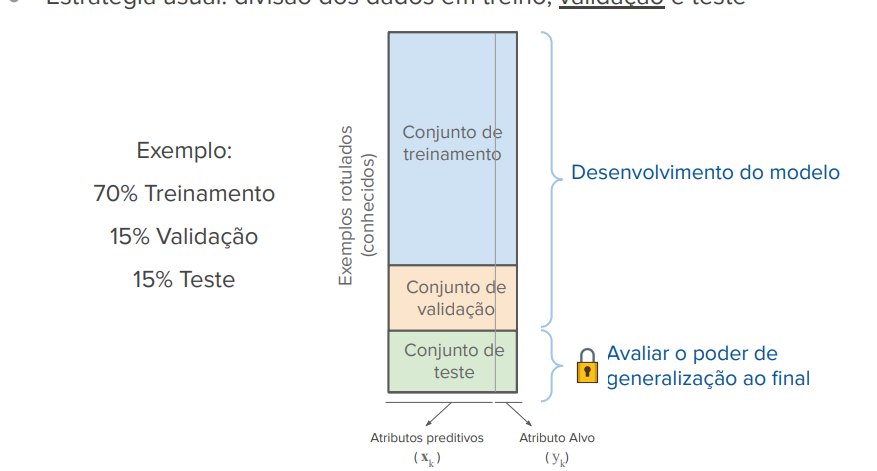

```
test_size = 0.15
validation_size = 0.15
validation_size_adjusted = validation_size / (1 - test_size) # 0.17647

X_temp, X_test, y_temp, y_test = train_test_split(
    X, y, test_size=test_size, random_state=42, stratify=y
)
X_train, X_val, y_train, y_val = train_test_split(
    X_temp, y_temp, test_size=val_size_adjusted, random_state=42, stratify=y_temp
)

```

Depois da divisão vamos avaliar qual dos valores de hiperparâmetro nos dá o melhor resultado.

```
depths = range(1, 21)
train_scores = []
val_scores = []

for d in depths:
   dt = DecisionTreeClassifier(max_depth=d, random_state=42)
   dt.fit(X_train, y_train)
   train_score = accuracy_score(y_train, dt.predict(X_train))
   val_score = accuracy_score(y_val, dt.predict(X_val))

   train_scores.append(train_score)
   val_scores.append(val_score)

plt.plot(depths, train_scores, label='Treino')
plt.plot(depths, val_scores, label='Validação')
plt.xlabel('max_depth')
plt.ylabel('Acurácia')
plt.legend()
plt.show()
```

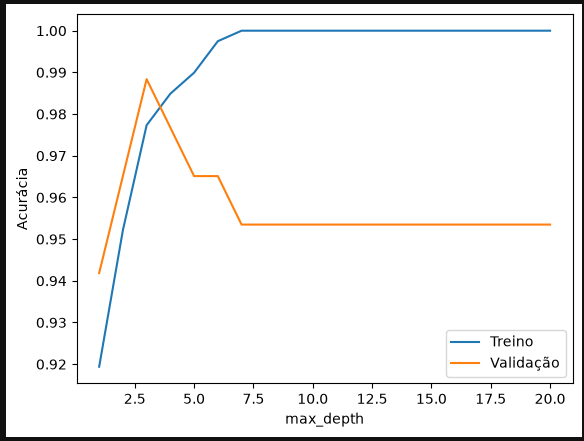


## Mais métricas de desempenho para supervisionados

### Problemas de classificação

* Acurácia - instâncias classificadas corretamente
* Precisão -  fração das predições positivas que estão corretas
* Sensibilidade (Recall) - taxa de verdadeiros positivos
* Especificidade - taxa de verdadeiros negativos


$$\text{Sensibilidade} = \frac{\text{Verdadeiros Positivos}}{\text{Verdadeiros Positivos} + \text{Falsos Negativos}}$$

$$\text{Especificidade} = \frac{\text{Verdadeiros Negativos}}{\text{Verdadeiros Negativos} + \text{Falsos Positivos}}$$


-----

Dependendo do que for mais importante utilizaremos a sensibilidade ou a especificidade como critérios na escolha do modelo.

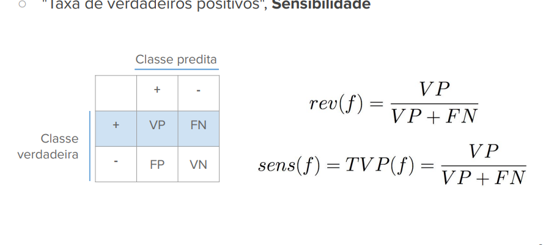

### Acurácia

Proporção de exemplos classificados corretamente.

Varia entre 0 e 1.

Um classificador pode ser visto através de uma **matriz de confusão**

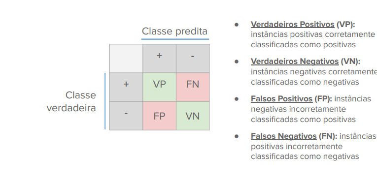

Os limites da acurácia !!!

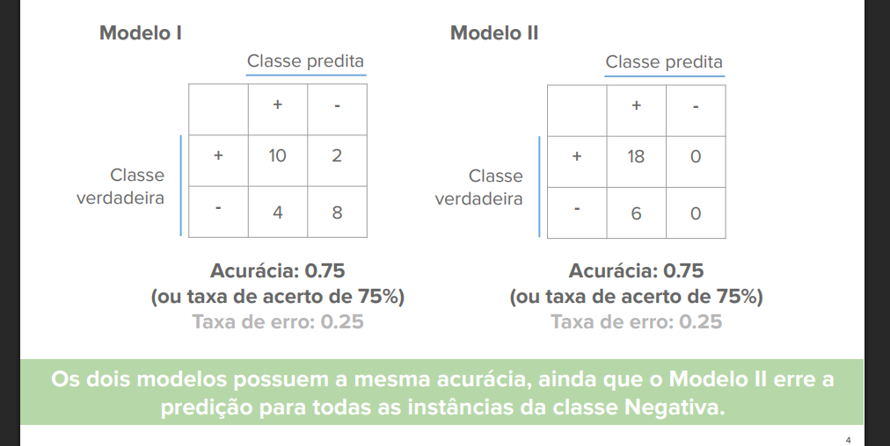

Não funciona quando os dados estão desbalanceados (desiquilíbrio no número de instâncias por classe)

### Recall (revocação)

**Recall**: taxa de verdadeiros positivos


#### Tradeoff entre Precisão (prediçẽs positivas corretas) e Recall.

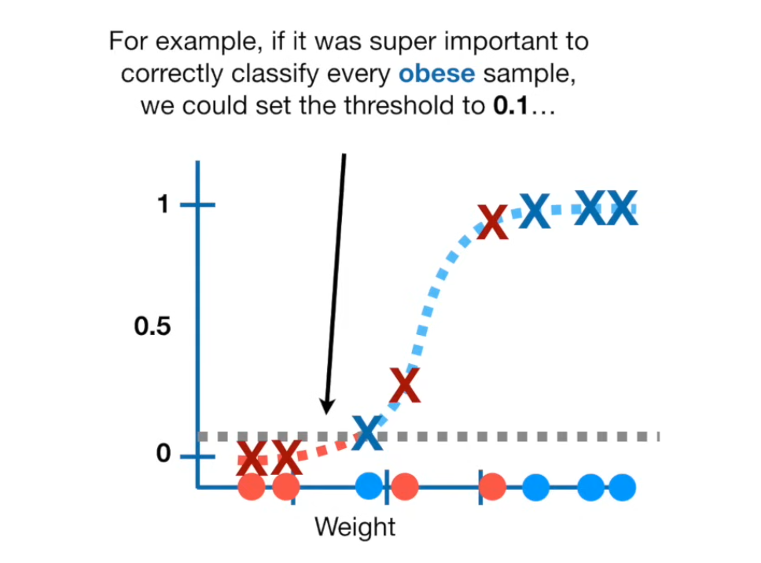

Recall (completude do modelo) X Precisão (exatidação do modelo)


Isso tem haver com o limiar de decisão (threshold) para modelos que entregam uma probabilidade do classificação.

Exemplo:

Modelo para fraudes bancárias. Usando um limiar de 30%, ou seja se houver 30% de chance de ser uma fraude ele vai classificar dessa forma.

**Previsões**: As transações A, B e C são marcadas como Fraude.

**Recall ALTO**: O modelo capturou praticamente todas as fraudes possíveis.

**Precisão BAIXA**: A Transação C (que era um cliente legítimo fazendo uma compra atípica) foi bloqueada por engano (Falso Positivo).

Se aumentarmos o threshold, teremos mais precisão mas aumenta a probabilidade de perder alguma transação falsa.

### F1-Score

Média harmônica ponderada entre precisão e recall (melhor que a média artimética porque penaliza )

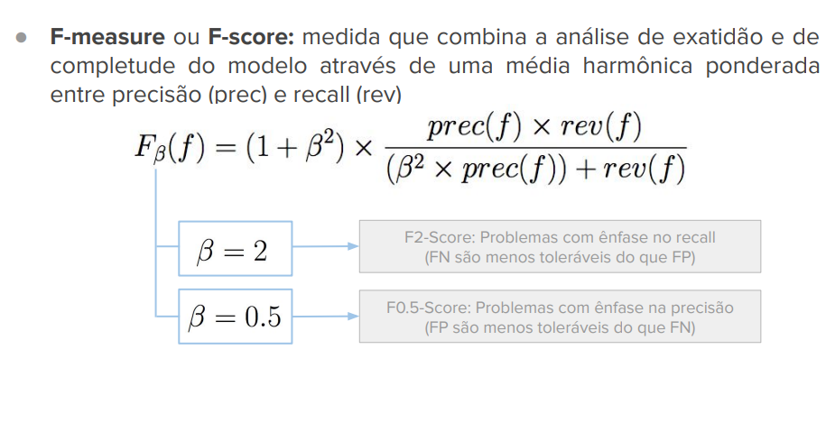


$$\text{F1-Score} = 2 \times \frac{\text{Precisão} \times \text{Recall}}{\text{Precisão} + \text{Recall}}$$

Varia entre 0 e 1.

1 é o modelo que tem precisão perfeita (zero falsos positivos) e recall perfeito (zero falsos negativos).


### Curva PR (Precision-Recall curve)

Curva de Precisão e Recall

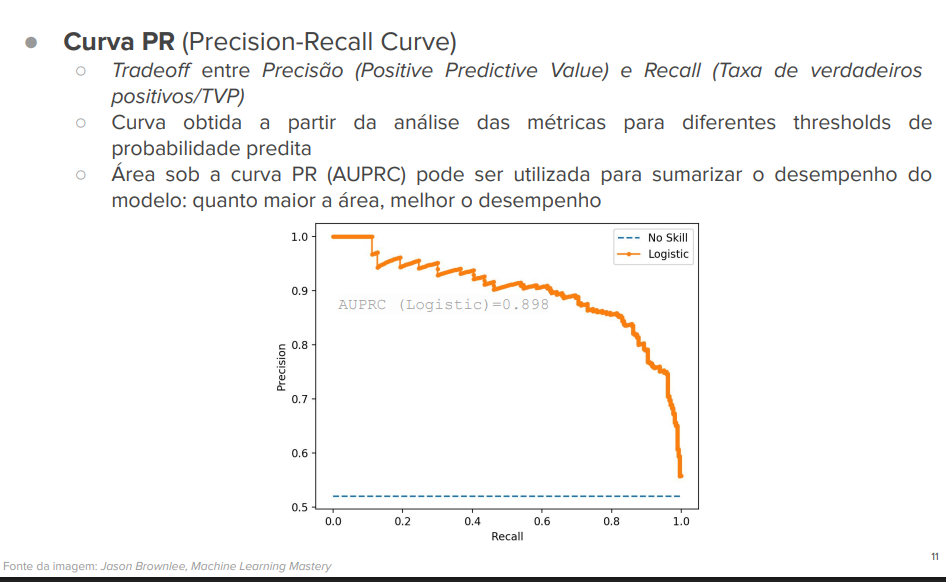

Como não é afetada pela taxa de falsos positivos, é indicada para casos com dados desbalanceados.


### Curva ROC (Receiver Operating Characteristic)

Curva de sensibilidade e especificidade.

Se for uma linha reta ligando os pontos (0,0) ao (1,1) então ele é um classificador aleatório.

Ela é usada mais para classificação binária e é sensível a dados desbalanceados.

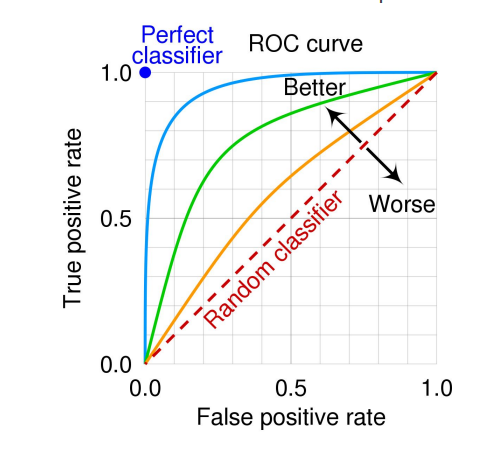

# Segunda Parte -  Validação Cruzada

### Random Sampling

Fazer amostragem aleatória (repeated holdout) estratificada tende a melhorar o desempenho médio do modelo, mas aumenta a variância para conjuntos de testes pequenos.

Ou seja, pode ter testes com dados desbalanceados, então podemos ter quedas na acurácia ao longo dos testes.

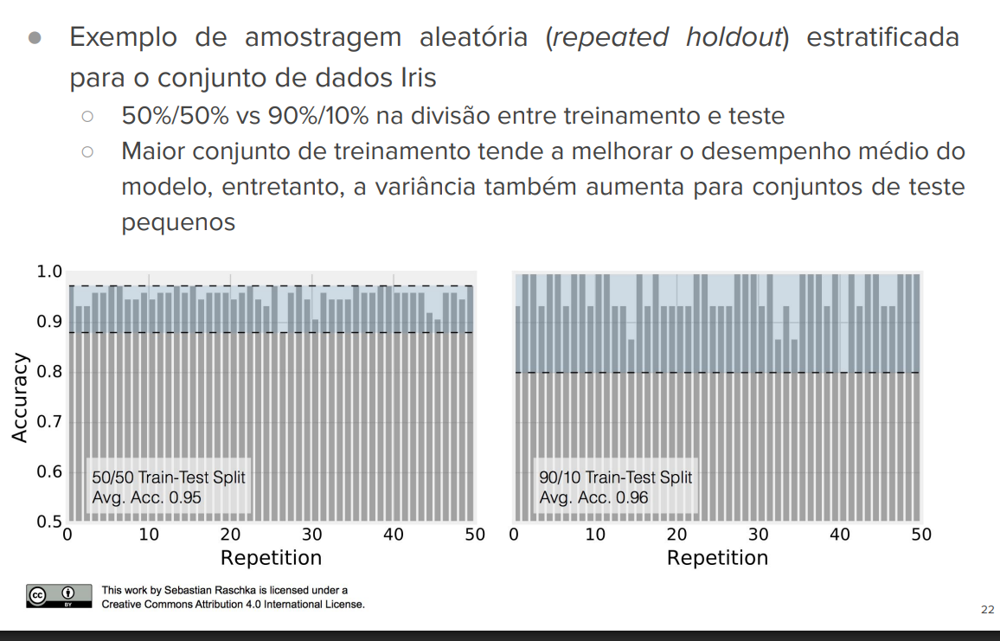

### Validação cruzada (k-fold Cross-Validation)

A validação Cruzada (k-fold cross-validation) é uma forma de garantir que todos os dados sejam usados para teste.

Então os dados são divididos em folds de tamanhos aproximadamente iguais e k - 1 são usados para treinamento e o restante para teste. E isso segue até todos serem usados para teste. Normalmente são 5 ou 10 folds.

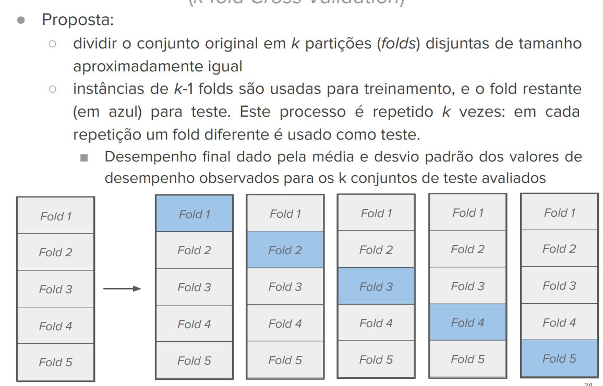

Com poucos dados usamos a estratégia leave-one-out.

### Nested cross-validation (validação cruzada aninhada)

Usado para otimizar hiperparâmetros.

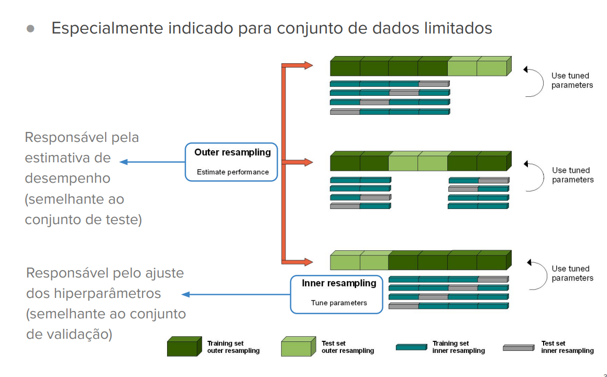

## Juntando tudo em um notebook

### Validação cruzada

```python
import numpy as np

from sklearn.datasets import load_breast_cancer
from sklearn.tree import DecisionTreeClassifier
from sklearn.model_selection import train_test_split, cross_val_score, StratifiedKFold, cross_validate
from sklearn.metrics import accuracy_score, f1_score, recall_score, precision_score
from sklearn.utils import shuffle

import matplotlib.pyplot as plt
import pandas as pd

data = load_breast_cancer()
X = data.data
y = data.target

X_train, X_test, y_train ,y_test = train_test_split(
    X,
    y,
    test_size=0.2,
    random_state=42,
    stratify=y
)

dt = DecisionTreeClassifier(random_state=42)
cv = StratifiedKFold(n_splits=5, shuffle=True, random_state=42)
scoring = [ 'accuracy', 'precision', 'recall', 'f1' ]
scores = cross_validate(dt, X_train, y_train, cv=cv, scoring=scoring, return_train_score=True)
```

|    | fit_time | score_time | test_accuracy | train_accuracy | test_precision | train_precision | test_recall | train_recall | test_f1 | train_f1 |
|---:|---------:|-----------:|--------------:|---------------:|---------------:|----------------:|------------:|-------------:|--------:|---------:|
| 0 | 0.003609 | 0.006219 | 0.967033 | 0.980769 | 0.966102 | 0.978355 | 0.982759 | 0.991228 | 0.974359 | 0.984749 |
| 1 | 0.002440 | 0.004132 | 0.923077 | 0.975275 | 0.903226 | 0.966102 | 0.982456 | 0.995633 | 0.941176 | 0.980645 |
| 2 | 0.002417 | 0.003796 | 0.901099 | 0.980769 | 0.944444 | 0.978448 | 0.894737 | 0.991266 | 0.918919 | 0.984816 |
| 3 | 0.002272 | 0.003575 | 0.956044 | 0.975275 | 0.964912 | 0.974138 | 0.964912 | 0.986900 | 0.964912 | 0.980477 |
| 4 | 0.002488 | 0.003808 | 0.912088 | 0.980769 | 0.915254 | 0.982609 | 0.947368 | 0.986900 | 0.931034 | 0.984749 |


### Nested cross validation

Nela vamos ter as funções de validação cruzada `StratifiedKFold` e `GridSearchCV` e elas são usadas na função de `cross_validate`.

Criamos duas K-Fold's uma para o modelo e outra para os hiperparâmetros.

```python
inner_cv = StratifiedKFold(n_splits=3, shuffle=True, random_state=42)
grid_search = GridSearchCV( estimator=dt, param_grid=param_grid, cv=inner_cv, scoring='f1', refit=True, n_jobs=-1)
nested_cv_results = cross_validate( estimator=grid_search, X=X, y=y, cv=outer_cv, scoring=scoring_metrics, return_train_score=False, )
```

Juntando em um notebook

```python
import numpy as np

from sklearn.datasets import load_breast_cancer
from sklearn.model_selection import train_test_split, cross_val_score, StratifiedKFold, cross_validate, GridSearchCV
from sklearn.tree import DecisionTreeClassifier
from sklearn.metrics import accuracy_score, f1_score, recall_score, precision_score
from sklearn.utils import shuffle

import matplotlib.pyplot as plt

import pandas as pd


# ============================================================
# 1. CARREGANDO OS DADOS
# ============================================================
data = load_breast_cancer()
X = data.data
y = data.target


# ============================================================
# 2. DEFININDO OS CROSS-VALIDATION FOLDS
# ============================================================

# CV interno:
# Será utilizado pelo GridSearchCV para encontrar
# os melhores hiperparâmetros do Decision Tree.
#
# O dataset será dividido em 3 partes.
# Em cada rodada:
#   - 2 partes são utilizadas para treinamento
#   - 1 parte é utilizada para validação
#
# StratifiedKFold mantém aproximadamente a mesma proporção
# das classes em cada fold.
inner_cv = StratifiedKFold(n_splits=3, shuffle=True, random_state=42)

# CV externo:
# Será utilizado para avaliar o desempenho final do processo
# completo de treinamento + seleção de hiperparâmetros.
#
# Aqui utilizamos 5 folds.
outer_cv = StratifiedKFold(n_splits=5, shuffle=True, random_state=42)

# ============================================================
# 3. DEFININDO OS HIPERPARÂMETROS
# ============================================================
param_grid = {
    'max_depth': [2, 3, 4, 5, 6, None],
    'criterion': ['gini', 'entropy'],
    'min_samples_split': [3, 6, 9]
}

# ============================================================
# 4. DEFININDO O MODELO
# ============================================================
dt = DecisionTreeClassifier(random_state=42)

# ============================================================
# 5. GRID SEARCH
# ============================================================
grid_search = GridSearchCV(
    estimator=dt,
    param_grid=param_grid,


    cv=inner_cv,

    # utiliza o F-1 para determinar a melhor combinação
    scoring='f1', 

    # Depois de encontrar a melhor combinação, o modelo
    # é treinado novamente utilizando essa configuração
    # sobre todos os dados disponíveis naquele fold externo.
    refit=True,

    # Permite executar os diferentes treinamentos em paralelo.
    n_jobs=-1
    n_jobs=-1
)

# ============================================================
# 6. MÉTRICAS
# ============================================================
scoring = [ 'accuracy', 'precision', 'recall', 'f1' ]

# ============================================================
# 7. NESTED CROSS-VALIDATION
# ============================================================
nested_cv_results = cross_validate(
    estimator=grid_search,
    X=X,
    y=y,
    cv=outer_cv,
    scoring=scoring_metrics,
    return_train_score=False
)

```

O teste externo não participa da escolha dos hiperparâmetros.

```text
Outer Fold 1


Dataset
│
├── 80% → treinamento
│          │
│          └── GridSearchCV
│              │
│              ├── combinação 1
│              ├── combinação 2
│              ├── ...
│              └── combinação 36
│
└── 20% → teste externo
```

```python
# ============================================================
# 8. ORGANIZANDO OS RESULTADOS
# ============================================================

results_summary = {}

for metric in scoring_metrics:

    # Recupera os resultados daquela métrica para
    # os 5 folds externos.
    scores = nested_cv_results[f'test_{metric}']

    # Calcula a média e o desvio padrão entre os folds.
    results_summary[metric] = {
        'Média': np.mean(scores),
        'Desvio Padrão': np.std(scores)
    }


# Converte o dicionário em DataFrame para facilitar
# a visualização.
df_results = pd.DataFrame(results_summary).T
print(df_results)


# ============================================================
# 9. PLOTANDO
# ============================================================

results_dict = {}
for metric, values in nested_cv_results.items():
    if metric.startswith('test_'):
        #print(metric)
        results_dict[metric] = values

df_results_plot = pd.DataFrame(results_dict)

plt.figure(figsize=(9,5))
df_results_plot.boxplot(patch_artist=True, boxprops=dict(facecolor='skyblue', color='black'), medianprops=dict(color='red', linewidth=1.5))

plt.title("Distribuição das Métricas nos Folds da Validação Cruzada", fontsize=13)
plt.ylabel("Score")
plt.xlabel("Métrica")
plt.ylim(0.8, 1.0)
plt.grid(axis='y', linestyle='--', alpha=0.7)

plt.tight_layout()
plt.show()
```

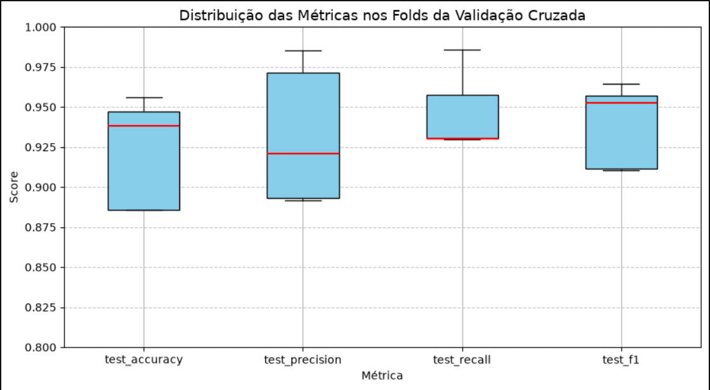