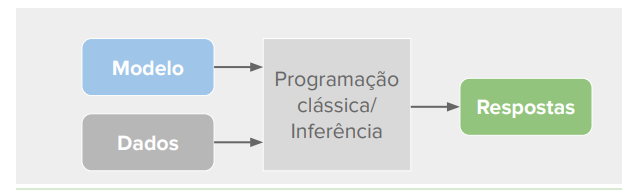
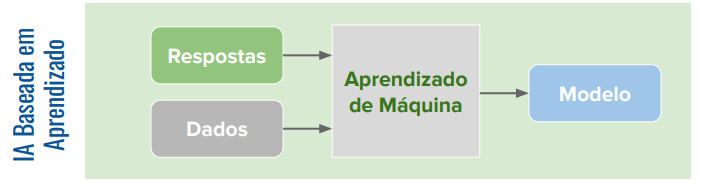
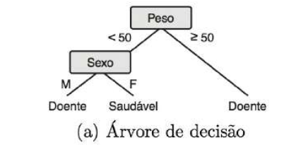

# IA simbólica

É feita com programação com inferência, um algoritmo clássico.

Modelo + Dados -> código que gera (respostas) um comportamento esperado.

# IA baseada em aprendizado

Resposta + Dados (temos um algortimo que gera modelos).

Aprendizado de máquina tem como objetivo imitar a forma como seres humanos aprendem.

### Do livro

A descoberta de uma hipótese (indução ou aproximação de função) a partir de uma experiência passada dá-se o nome de Aprendizado de Máquina.

#### Viés Indutivo

Cada algoritmo de Aprendizado de Máquina utiliza uma forma ou representação para descrever a hipótese induzida. 

A representação utilizada define a preferência ou viés de representação do algoritmo e pode restringir o conjunto de hipóteses que podem ser induzidas pelo algoritmo.

A árvore de decisão utiliza uma estrutura de árvore em que cada nó interno é representado por uma pergunta referente ao valor de um atributo e cada nó externo está associado a uma classe.

Além do viés indutivo temos o viés de busca, que é a forma como o algoritmo busca as hipóteses que melhor se ajustam aos dados de treinamento. Por exemplo, o algoritmo ID3, utilizado em árvores de decisão, tem como viés de busca árvores de decisão com poucos nós.