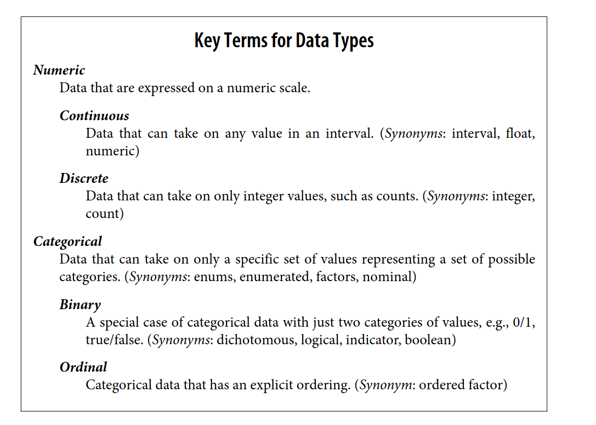
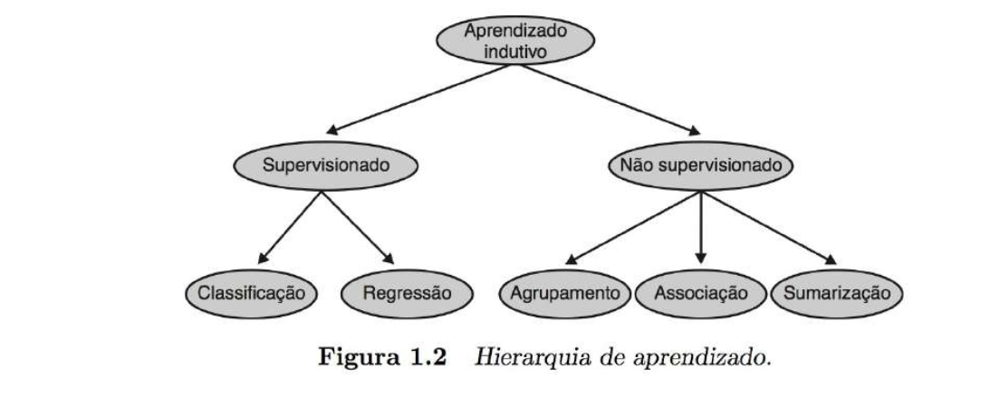

## Tipos de dados

## Tipos de tarefas de aprendizado

Preditivas - quando nos dados temos a resposta (paradigma de aprendizado supervisionado)

Descritivas - quando não temos as respostas (não supervisionado)

No supervisionado teremos a regressão para numéricos e classificação para categóricos.